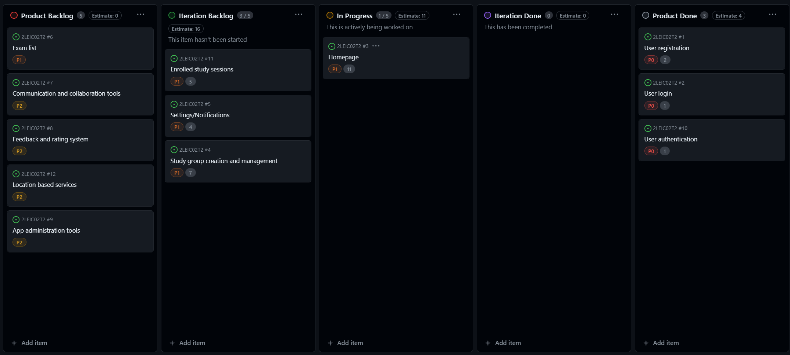

## StudySync Development Report

Welcome to the documentation pages of StudySync!

You can find here details about StudySync, from a high-level vision to low-level implementation decisions, a kind of Software Development Report, organized by type of activities:

* [Business Modelling](#business-modelling)
    * [Product Vision](#product-vision)
    * [Features and Assumptions](#features-and-assumptions)
* [Requirements](#requirements)
    * [Domain Model](#domain-model)
* [Architecture and Design](#architecture-and-design)
    * [Logical architecture](#logical-architecture)
    * [Physical architecture](#physical-architecture)
    * [Vertical prototype](#vertical-prototype)
* [Project Management](#project-management)
* [UI Prototype on Figma](https://www.figma.com/file/CobErmNGkBupGDG9aVAxHm/FEUP-Study-Sync?type=design&node-id=14%3A6&mode=design&t=GdusRaJIJFQAQ2xl-1)

Contributions are expected to be made exclusively by the initial team, but we may open them to the community, after the course, in all areas and topics: requirements, technologies, development, experimentation, testing, etc.

Please contact us!

Thank you!

Software Enginnering - 2LEIC02 Team 2
- Emanuel Rui Tavano Maia - up202107486@up.pt
- Gonçalo Miguel Dias Ferros - up202207592@up.pt
- Irene Scarion Muntu - up202311903@up.pt
- Oleksandr Aleshchenko - up202201478@up.pt

## Business Modelling 
### Product Vision
> **StudySync** is a personal and social study management app for university students. StudySync will help the academic community become a more sustainable study environment, by connecting more students together in a way that is specialized and efficient and providing efficient study tools.

### Features and Assumptions
- Planning group study sessions - students can define break times, places to meet up, study subjects and goal exams.
- Keeping track of exam dates and notify users if there's a study group meeting up to study for an exam they also have 
- Studying notes - users can organize which topics they need to study, which ones they've already studied, etc.
- Getting notifications about exams - this feature is similar to getting notifications about study groups, but only for exams. Maybe it would be interesting to disable, for instance, study group notifications for all courses or maybe just specific ones if the user isn't interested in the social aspect of the application.
- Send break notifications/advice to avoid long study sessions and burnout and amplify studying efficiency.

## Requirements

### Domain Model

  

## Architecture and Design

### Logical architecture

### Physical architecture

### Vertical prototype
The currently implemented features are user registration and login, using Firebase platform as backend for the application.

## Project Management
- Backlog management: check our [Github Project board](https://github.com/orgs/FEUP-LEIC-ES-2023-24/projects/60);

### Sprint 1
#### Start

#### End

### Sprint 2
#### Start

#### End
